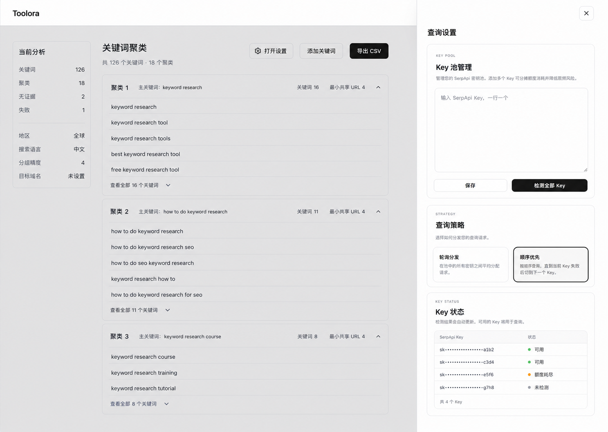

# Toolora Visual Direction Decision

Status: selected
Date: 2026-08-30

## Selected reference

Supporting application references:

- [Homepage Catalog](./options/homepage-catalog-reference.png)
- [Keyword Ranking form](./options/keyword-ranking-form-reference.png)
- [Shared SerpAPI Settings Sheet](./options/serpapi-settings-sheet-reference.png)

## Direction

Use the revised light, restrained split-workspace direction as the shared visual language for Toolora.

### Global shell

- Header shows the Toolora wordmark and theme control only.
- Do not list individual Tools in the header.
- Homepage retains the old Toolora catalog structure: search, category navigation, Tool cards, and generous whitespace.
- UI is Chinese-only; no language control.

### Tool pages

- Each Tool page owns an **打开设置** action inside its Workspace header.
- Keyword Ranking and Keyword Clustering open the same shared SerpAPI Settings Sheet.
- The Sheet enters from the right over a neutral dim/blur backdrop, traps focus, closes with Escape/backdrop/close button, and returns focus to the opener.
- The underlying Tool remains visible as context but unavailable while the Sheet is modal.

### Keyword Clustering

- Keep the selected narrow Analysis summary plus wide Cluster results hierarchy.
- Use compact expandable Cluster groups and lightweight rows.
- Show Primary Keyword, Cluster size, Minimum Shared URL count, optional Domain Analysis, No Evidence, and Failed.
- Do not show search volume: SerpAPI Google Light does not provide it and the product accepts no volume input.
- Do not show Project name/history, Target URL, Search Intent, Topical Clusters, or opportunity metrics.

### Implementation latitude

The mock establishes hierarchy, density, settings behavior, neutral palette, border/radius character, and modal placement. During implementation, copy, exact spacing, responsive transformations, visible columns, and state-specific details may change to satisfy the accepted Specs, accessibility, real data, and browser verification.

## Next design applications

Apply this direction to:

1. Homepage Catalog
2. Keyword Ranking ready/running/result/error states
3. Keyword Clustering input/running/Card/Table/error states
4. SerpAPI Settings states and storage-recovery dialogs
5. Light/Dark/System and reduced-motion theme transition
6. mobile and narrow desktop layouts
